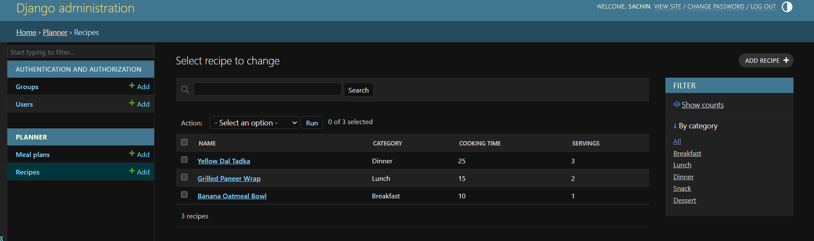

# RecipeMealPlanner

A Django-based meal planning platform for creating, managing, and organizing recipes and daily meal schedules through a simple and user-friendly interface.

## Project Overview

RecipeMealPlanner is a web-based application developed using Python and the Django framework. The application provides a structured platform for managing culinary recipes and scheduling them into daily meal slots (Breakfast, Lunch, Dinner, Snack).

This project was developed as an academic project to gain practical experience in Python web development, Django, database management, and version control using Git and GitHub.

## Features

- Create and manage recipes with detailed ingredients, instructions, and cooking times
- Categorize recipes across standard meal types
- Schedule daily and weekly meal plans linked directly to recipes
- Django-based administrative backend with custom filters and search capabilities
- SQLite database for local development
- Organized Django project and application structure
- Referential integrity with cascading relationships between meal plans and recipes

## Technologies Used

- **Programming Language:** Python
- **Web Framework:** Django
- **Database:** SQLite3
- **Version Control:** Git & GitHub

## Screenshots



## Setup and Installation

1. **Clone the repository:**
   ```bash
   git clone [https://github.com/SachinJayswal27/Recipe-Meal-Planner-Django.git](https://github.com/SachinJayswal27/Recipe-Meal-Planner-Django.git)
   cd Recipe-Meal-Planner-Django

